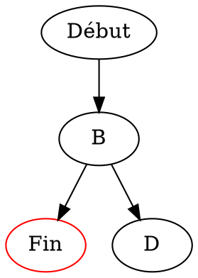

# Guide des Outils - ML Sandbox

Documentation complète de tous les outils installés dans le container Docker.

---

## Table des Matières

1. [Outils Système (Linux)](#1-outils-système-linux)
2. [Machine Learning & Deep Learning](#2-machine-learning--deep-learning)
3. [Data Processing & Analysis](#3-data-processing--analysis)
4. [Visualisation](#4-visualisation)
5. [Environnement Jupyter](#5-environnement-jupyter)
6. [Outils ML (Tracking, Tuning, Explainability)](#6-outils-ml-tracking-tuning-explainability)
7. [Traitement d'Images](#7-traitement-dimages)
8. [NLP & LLM](#8-nlp--llm)
9. [PDF & Documents](#9-pdf--documents)
10. [OCR](#10-ocr)
11. [LaTeX](#11-latex)
12. [Sérialisation & Formats](#12-sérialisation--formats)
13. [Web & API](#13-web--api)
14. [Base de Données](#14-base-de-données)
15. [Utilitaires Python](#15-utilitaires-python)
16. [Tests & Qualité de Code](#16-tests--qualité-de-code)
17. [Profiling & Debugging](#17-profiling--debugging)

---

## 1. Outils Système (Linux)

### Build Tools

| Outil | Description | Exemple |
|-------|-------------|---------|
| `build-essential` | Compilateurs GCC, G++, make | `gcc -o programme source.c` |
| `cmake` | Système de build cross-platform | `cmake . && make` |
| `pkg-config` | Gestion des flags de compilation | `pkg-config --cflags opencv` |

### Utilitaires de Base

| Outil | Description | Exemple |
|-------|-------------|---------|
| `curl` | Transfert de données via URL | `curl -O https://example.com/file.zip` |
| `wget` | Téléchargement de fichiers | `wget https://example.com/data.csv` |
| `git` | Contrôle de version | `git clone https://github.com/user/repo` |
| `vim` | Éditeur de texte avancé | `vim fichier.py` |
| `nano` | Éditeur de texte simple | `nano fichier.txt` |
| `htop` | Moniteur de processus interactif | `htop` |
| `tree` | Affichage arborescent des dossiers | `tree -L 2` |

### Compression / Archives

| Outil | Description | Compression | Décompression |
|-------|-------------|-------------|---------------|
| `zip/unzip` | Format ZIP standard | `zip -r archive.zip dossier/` | `unzip archive.zip` |
| `p7zip-full` | Format 7z (haute compression) | `7z a archive.7z dossier/` | `7z x archive.7z` |
| `tar` | Archivage (sans compression) | `tar -cvf archive.tar dossier/` | `tar -xvf archive.tar` |
| `gzip` | Compression .gz | `gzip fichier` | `gunzip fichier.gz` |
| `bzip2` | Compression .bz2 | `bzip2 fichier` | `bunzip2 fichier.bz2` |
| `xz-utils` | Compression .xz (meilleure) | `xz fichier` | `unxz fichier.xz` |

**Combinaisons courantes :**
```bash
# tar.gz (le plus courant)
tar -czvf archive.tar.gz dossier/    # Créer
tar -xzvf archive.tar.gz             # Extraire

# tar.bz2 (meilleure compression)
tar -cjvf archive.tar.bz2 dossier/   # Créer
tar -xjvf archive.tar.bz2            # Extraire

# tar.xz (compression maximale)
tar -cJvf archive.tar.xz dossier/    # Créer
tar -xJvf archive.tar.xz             # Extraire
```

### Traitement d'Images (Ligne de Commande)

#### ImageMagick
Manipulation d'images en ligne de commande.

```bash
# Conversion de format
convert image.png image.jpg
convert image.png image.webp

# Redimensionner
convert image.png -resize 800x600 output.png    # Dimensions exactes
convert image.png -resize 50% output.png        # Pourcentage
convert image.png -resize 800x output.png       # Largeur fixe, hauteur auto

# Rotation
convert image.png -rotate 90 output.png

# Recadrage
convert image.png -crop 400x300+100+50 output.png  # largeur x hauteur + offset_x + offset_y

# Qualité (pour JPEG)
convert image.png -quality 85 output.jpg

# Combiner plusieurs images
convert image1.png image2.png +append horizontal.png  # Côte à côte
convert image1.png image2.png -append vertical.png    # Empilées

# Créer un PDF à partir d'images
convert *.jpg output.pdf

# Créer un GIF animé
convert -delay 100 -loop 0 frame*.png animation.gif

# Ajouter du texte
convert image.png -pointsize 36 -fill white -annotate +50+50 'Texte' output.png

# Informations sur une image
identify image.png
identify -verbose image.png
```

#### Graphviz
Création de graphes et diagrammes.

```bash
# Créer un graphe depuis un fichier .dot
dot -Tpng graph.dot -o graph.png
dot -Tsvg graph.dot -o graph.svg
dot -Tpdf graph.dot -o graph.pdf

# Différents moteurs de rendu
neato -Tpng graph.dot -o graph.png    # Graphes non dirigés
circo -Tpng graph.dot -o graph.png    # Layout circulaire
fdp -Tpng graph.dot -o graph.png      # Force-directed
```

**Exemple de fichier .dot :**


#### FFmpeg
Manipulation audio/vidéo.

```bash
# Conversion de format
ffmpeg -i video.avi video.mp4
ffmpeg -i audio.wav audio.mp3

# Extraire l'audio d'une vidéo
ffmpeg -i video.mp4 -vn audio.mp3

# Extraire une image d'une vidéo
ffmpeg -i video.mp4 -ss 00:01:30 -frames:v 1 screenshot.png

# Redimensionner une vidéo
ffmpeg -i video.mp4 -vf scale=1280:720 output.mp4

# Couper une vidéo
ffmpeg -i video.mp4 -ss 00:00:30 -to 00:01:00 -c copy extrait.mp4

# Créer une vidéo à partir d'images
ffmpeg -framerate 30 -i frame%04d.png -c:v libx264 video.mp4

# Compresser une vidéo
ffmpeg -i video.mp4 -crf 28 compressed.mp4  # CRF: 0-51, plus haut = plus compressé

# GIF à partir d'une vidéo
ffmpeg -i video.mp4 -vf "fps=10,scale=320:-1" output.gif
```

### PDF Tools

#### poppler-utils
Manipulation de PDF en ligne de commande.

```bash
# PDF vers images
pdftoppm document.pdf output -png           # Toutes les pages
pdftoppm document.pdf output -png -f 1 -l 5 # Pages 1 à 5

# PDF vers texte
pdftotext document.pdf                      # Crée document.txt
pdftotext document.pdf -                    # Affiche sur stdout
pdftotext -layout document.pdf output.txt   # Préserve la mise en page

# Informations sur un PDF
pdfinfo document.pdf

# Fusionner des PDFs
pdfunite file1.pdf file2.pdf file3.pdf merged.pdf

# Séparer un PDF
pdfseparate document.pdf page_%d.pdf

# Extraire des pages
pdfseparate -f 5 -l 10 document.pdf page_%d.pdf  # Pages 5 à 10
```

#### Ghostscript
Traitement avancé de PDF/PostScript.

```bash
# Compresser un PDF
gs -sDEVICE=pdfwrite -dCompatibilityLevel=1.4 -dPDFSETTINGS=/ebook \
   -dNOPAUSE -dQUIET -dBATCH -sOutputFile=compressed.pdf input.pdf

# Options de compression:
# /screen   - 72 dpi (très petite taille)
# /ebook    - 150 dpi (bonne qualité)
# /printer  - 300 dpi (haute qualité)
# /prepress - 300 dpi (qualité maximale)

# PDF vers images haute résolution
gs -dNOPAUSE -dBATCH -sDEVICE=png16m -r300 -sOutputFile=page%03d.png document.pdf

# Réparer un PDF corrompu
gs -o repaired.pdf -sDEVICE=pdfwrite -dPDFSETTINGS=/prepress damaged.pdf
```

### LibreOffice (Mode Headless)

Conversion de documents Office sans interface graphique.

```bash
# Word → PDF
libreoffice --headless --convert-to pdf document.docx

# PowerPoint → PDF
libreoffice --headless --convert-to pdf presentation.pptx

# Excel → PDF
libreoffice --headless --convert-to pdf spreadsheet.xlsx

# Word → Texte brut
libreoffice --headless --convert-to txt document.docx

# PowerPoint → Images (une par slide)
libreoffice --headless --convert-to png presentation.pptx

# Excel → CSV
libreoffice --headless --convert-to csv spreadsheet.xlsx

# Spécifier le dossier de sortie
libreoffice --headless --convert-to pdf --outdir /output document.docx

# Conversion par lot
libreoffice --headless --convert-to pdf *.docx
```

### OCR - Tesseract

Reconnaissance optique de caractères.

```bash
# OCR basique (anglais par défaut)
tesseract image.png output              # Crée output.txt

# OCR en français
tesseract image.png output -l fra

# OCR multilingue
tesseract image.png output -l fra+eng

# Sortie en différents formats
tesseract image.png output -l fra pdf   # PDF searchable
tesseract image.png output -l fra hocr  # HTML avec coordonnées

# Améliorer la qualité
tesseract image.png output -l fra --psm 1  # Auto-rotation
tesseract image.png output -l fra --psm 6  # Bloc de texte uniforme

# Modes PSM (Page Segmentation Mode):
# 0  - Orientation et détection de script uniquement
# 1  - Segmentation auto avec OSD
# 3  - Segmentation auto (défaut)
# 6  - Bloc de texte uniforme
# 7  - Ligne de texte unique
# 8  - Mot unique
# 10 - Caractère unique
# 11 - Texte épars
# 13 - Ligne brute
```

### Audio - Sox

Traitement audio en ligne de commande.

```bash
# Informations sur un fichier audio
sox --info audio.wav
soxi audio.wav

# Conversion de format
sox audio.wav audio.mp3
sox audio.flac audio.ogg

# Modifier le volume
sox audio.wav output.wav vol 0.5        # Réduire de moitié
sox audio.wav output.wav vol 2          # Doubler

# Changer la fréquence d'échantillonnage
sox audio.wav output.wav rate 22050

# Convertir en mono
sox audio.wav output.wav channels 1

# Couper un extrait
sox audio.wav output.wav trim 10 30     # De 10s à 40s (30s de durée)

# Concaténer des fichiers
sox audio1.wav audio2.wav output.wav

# Normaliser le volume
sox audio.wav output.wav norm

# Ajouter du silence
sox audio.wav output.wav pad 2 3        # 2s début, 3s fin

# Statistiques audio
sox audio.wav -n stat
```

### Comparaison de Fichiers

```bash
# diff - Comparaison ligne par ligne
diff file1.txt file2.txt
diff -u file1.txt file2.txt             # Format unifié (patch)
diff -y file1.txt file2.txt             # Côte à côte

# wdiff - Comparaison mot par mot
wdiff file1.txt file2.txt
wdiff -c file1.txt file2.txt            # Avec couleurs
```

### Autres Utilitaires

| Outil | Description | Exemple |
|-------|-------------|---------|
| `jq` | Traitement JSON en ligne de commande | `cat data.json \| jq '.items[]'` |
| `sqlite3` | Base de données SQLite | `sqlite3 database.db "SELECT * FROM table"` |
| `rsync` | Synchronisation de fichiers | `rsync -avz source/ dest/` |
| `ssh` | Connexion sécurisée | `ssh user@server` |
| `scp` | Copie sécurisée | `scp file.txt user@server:/path/` |

**Exemples jq :**
```bash
# Extraire un champ
cat data.json | jq '.name'

# Filtrer un tableau
cat data.json | jq '.items[] | select(.price > 100)'

# Formater du JSON
cat data.json | jq '.'

# Créer un nouveau JSON
cat data.json | jq '{nom: .name, prix: .price}'
```

---

## 2. Machine Learning & Deep Learning

### scikit-learn
Bibliothèque ML classique pour Python.

```python
from sklearn.model_selection import train_test_split
from sklearn.ensemble import RandomForestClassifier
from sklearn.metrics import accuracy_score, classification_report

# Préparation des données
X_train, X_test, y_train, y_test = train_test_split(X, y, test_size=0.2)

# Entraînement
model = RandomForestClassifier(n_estimators=100)
model.fit(X_train, y_train)

# Prédiction et évaluation
predictions = model.predict(X_test)
print(f"Accuracy: {accuracy_score(y_test, predictions):.2f}")
print(classification_report(y_test, predictions))
```

**Algorithmes disponibles :**
- Classification : RandomForest, SVM, LogisticRegression, KNN, GradientBoosting
- Régression : LinearRegression, Ridge, Lasso, ElasticNet, SVR
- Clustering : KMeans, DBSCAN, AgglomerativeClustering
- Réduction de dimension : PCA, t-SNE, UMAP
- Prétraitement : StandardScaler, MinMaxScaler, LabelEncoder, OneHotEncoder

### PyTorch
Framework de deep learning.

```python
import torch
import torch.nn as nn
import torch.optim as optim

# Définir un modèle
class SimpleNN(nn.Module):
    def __init__(self, input_size, hidden_size, output_size):
        super().__init__()
        self.fc1 = nn.Linear(input_size, hidden_size)
        self.relu = nn.ReLU()
        self.fc2 = nn.Linear(hidden_size, output_size)

    def forward(self, x):
        x = self.fc1(x)
        x = self.relu(x)
        x = self.fc2(x)
        return x

# Créer le modèle
model = SimpleNN(784, 128, 10)

# Définir loss et optimizer
criterion = nn.CrossEntropyLoss()
optimizer = optim.Adam(model.parameters(), lr=0.001)

# Entraînement
for epoch in range(epochs):
    optimizer.zero_grad()
    outputs = model(inputs)
    loss = criterion(outputs, labels)
    loss.backward()
    optimizer.step()

# GPU support
device = torch.device("cuda" if torch.cuda.is_available() else "cpu")
model.to(device)
```

### TensorFlow / Keras
Framework de deep learning (style déclaratif).

```python
import tensorflow as tf
from tensorflow import keras
from keras import layers

# Modèle séquentiel
model = keras.Sequential([
    layers.Dense(128, activation='relu', input_shape=(784,)),
    layers.Dropout(0.2),
    layers.Dense(64, activation='relu'),
    layers.Dense(10, activation='softmax')
])

# Compilation
model.compile(
    optimizer='adam',
    loss='sparse_categorical_crossentropy',
    metrics=['accuracy']
)

# Entraînement
history = model.fit(X_train, y_train, epochs=10, validation_split=0.2)

# Évaluation
model.evaluate(X_test, y_test)

# Sauvegarde/Chargement
model.save('model.keras')
model = keras.models.load_model('model.keras')
```

### XGBoost
Gradient boosting optimisé.

```python
import xgboost as xgb
from sklearn.model_selection import cross_val_score

# Classification
model = xgb.XGBClassifier(
    n_estimators=100,
    max_depth=6,
    learning_rate=0.1,
    objective='binary:logistic'
)
model.fit(X_train, y_train)

# Régression
model = xgb.XGBRegressor(
    n_estimators=100,
    max_depth=6,
    learning_rate=0.1
)

# Feature importance
importance = model.feature_importances_
xgb.plot_importance(model)
```

### LightGBM
Gradient boosting rapide et efficace.

```python
import lightgbm as lgb

# Créer le dataset LightGBM
train_data = lgb.Dataset(X_train, label=y_train)
valid_data = lgb.Dataset(X_valid, label=y_valid, reference=train_data)

# Paramètres
params = {
    'objective': 'binary',
    'metric': 'auc',
    'num_leaves': 31,
    'learning_rate': 0.05,
    'feature_fraction': 0.9
}

# Entraînement avec early stopping
model = lgb.train(
    params,
    train_data,
    num_boost_round=1000,
    valid_sets=[valid_data],
    callbacks=[lgb.early_stopping(50)]
)

# Prédiction
predictions = model.predict(X_test)
```

### CatBoost
Gradient boosting avec support natif des catégories.

```python
from catboost import CatBoostClassifier, Pool

# Spécifier les colonnes catégorielles
cat_features = ['color', 'size', 'category']

# Créer le modèle
model = CatBoostClassifier(
    iterations=1000,
    learning_rate=0.1,
    depth=6,
    cat_features=cat_features,
    verbose=100
)

# Entraînement
model.fit(X_train, y_train, eval_set=(X_valid, y_valid))

# Feature importance
model.get_feature_importance(prettified=True)
```

---

## 3. Data Processing & Analysis

### NumPy
Calcul numérique et tableaux multidimensionnels.

```python
import numpy as np

# Création de tableaux
arr = np.array([1, 2, 3, 4, 5])
matrix = np.array([[1, 2], [3, 4]])
zeros = np.zeros((3, 4))
ones = np.ones((2, 3))
range_arr = np.arange(0, 10, 2)
linspace = np.linspace(0, 1, 100)
random = np.random.randn(3, 3)

# Opérations
arr * 2                    # Multiplication élément par élément
np.dot(matrix, matrix)     # Produit matriciel
matrix @ matrix            # Produit matriciel (Python 3.5+)
np.sum(arr)
np.mean(arr)
np.std(arr)

# Indexation avancée
arr[arr > 2]               # Filtrage booléen
matrix[:, 0]               # Première colonne
matrix[0, :]               # Première ligne

# Reshape
arr.reshape(5, 1)
matrix.flatten()
matrix.T                   # Transposée
```

### Pandas
Manipulation et analyse de données tabulaires.

```python
import pandas as pd

# Création
df = pd.DataFrame({
    'nom': ['Alice', 'Bob', 'Charlie'],
    'age': [25, 30, 35],
    'ville': ['Paris', 'Lyon', 'Marseille']
})

# Lecture de fichiers
df = pd.read_csv('data.csv')
df = pd.read_excel('data.xlsx')
df = pd.read_json('data.json')
df = pd.read_parquet('data.parquet')

# Exploration
df.head()
df.info()
df.describe()
df.shape
df.columns
df.dtypes

# Sélection
df['nom']                  # Une colonne
df[['nom', 'age']]         # Plusieurs colonnes
df.loc[0]                  # Par label
df.iloc[0]                 # Par position
df[df['age'] > 25]         # Filtrage

# Modification
df['nouveau'] = df['age'] * 2
df.drop('colonne', axis=1, inplace=True)
df.rename(columns={'old': 'new'}, inplace=True)

# Agrégation
df.groupby('ville')['age'].mean()
df.pivot_table(values='age', index='ville', aggfunc='mean')

# Jointures
pd.merge(df1, df2, on='id', how='left')
df1.join(df2, on='id')

# Export
df.to_csv('output.csv', index=False)
df.to_parquet('output.parquet')
df.to_excel('output.xlsx')
```

### Polars
Alternative rapide à Pandas (Rust-based).

```python
import polars as pl

# Lecture
df = pl.read_csv('data.csv')
df = pl.read_parquet('data.parquet')

# Sélection et filtrage (lazy evaluation)
result = (
    df.lazy()
    .filter(pl.col('age') > 25)
    .select(['nom', 'age'])
    .with_columns([
        (pl.col('age') * 2).alias('age_double')
    ])
    .collect()
)

# Agrégation
df.group_by('ville').agg([
    pl.col('age').mean().alias('age_moyen'),
    pl.col('nom').count().alias('count')
])

# Conversion Pandas <-> Polars
pandas_df = df.to_pandas()
polars_df = pl.from_pandas(pandas_df)
```

### SciPy
Calcul scientifique avancé.

```python
from scipy import stats, optimize, interpolate, signal

# Statistiques
stats.ttest_ind(group1, group2)     # Test t
stats.pearsonr(x, y)                # Corrélation
stats.normaltest(data)              # Test de normalité
stats.kstest(data, 'norm')          # Test Kolmogorov-Smirnov

# Optimisation
from scipy.optimize import minimize
result = minimize(lambda x: x**2 + 2*x + 1, x0=0)

# Interpolation
f = interpolate.interp1d(x, y, kind='cubic')
y_new = f(x_new)

# Traitement du signal
filtered = signal.savgol_filter(data, window_length=51, polyorder=3)
peaks, _ = signal.find_peaks(data, height=0.5)
```

### PyArrow / Parquet
Format de stockage colonaire efficace.

```python
import pyarrow as pa
import pyarrow.parquet as pq

# Écriture Parquet
table = pa.Table.from_pandas(df)
pq.write_table(table, 'data.parquet', compression='snappy')

# Lecture Parquet
table = pq.read_table('data.parquet')
df = table.to_pandas()

# Lecture partielle (colonnes spécifiques)
df = pq.read_table('data.parquet', columns=['col1', 'col2']).to_pandas()

# Dataset partitionné
pq.write_to_dataset(table, root_path='dataset/', partition_cols=['year', 'month'])
```

---

## 4. Visualisation

### Matplotlib
Bibliothèque de visualisation de base.

```python
import matplotlib.pyplot as plt

# Graphique simple
plt.figure(figsize=(10, 6))
plt.plot(x, y, label='Données', color='blue', linestyle='-', marker='o')
plt.xlabel('X')
plt.ylabel('Y')
plt.title('Mon Graphique')
plt.legend()
plt.grid(True)
plt.savefig('graph.png', dpi=300, bbox_inches='tight')
plt.show()

# Subplots
fig, axes = plt.subplots(2, 2, figsize=(12, 10))
axes[0, 0].plot(x, y)
axes[0, 1].scatter(x, y)
axes[1, 0].bar(categories, values)
axes[1, 1].hist(data, bins=30)
plt.tight_layout()

# Styles
plt.style.use('seaborn-v0_8')  # ou 'ggplot', 'dark_background', etc.
```

### Seaborn
Visualisation statistique élégante.

```python
import seaborn as sns

# Configuration
sns.set_theme(style="whitegrid")

# Distribution
sns.histplot(data=df, x='age', kde=True)
sns.kdeplot(data=df, x='age', hue='category')
sns.boxplot(data=df, x='category', y='value')
sns.violinplot(data=df, x='category', y='value')

# Relations
sns.scatterplot(data=df, x='x', y='y', hue='category', size='value')
sns.lineplot(data=df, x='date', y='value', hue='category')
sns.regplot(data=df, x='x', y='y')  # Avec régression

# Catégoriel
sns.countplot(data=df, x='category')
sns.barplot(data=df, x='category', y='value')

# Matrices
sns.heatmap(correlation_matrix, annot=True, cmap='coolwarm')
sns.clustermap(data, cmap='viridis')

# Pairplot (toutes les combinaisons)
sns.pairplot(df, hue='category')
```

### Plotly
Graphiques interactifs.

```python
import plotly.express as px
import plotly.graph_objects as go

# Graphiques Express (rapide)
fig = px.scatter(df, x='x', y='y', color='category', size='value',
                 hover_data=['name'], title='Mon Scatter Plot')
fig.show()

fig = px.line(df, x='date', y='value', color='category')
fig = px.bar(df, x='category', y='value', color='subcategory')
fig = px.histogram(df, x='value', nbins=50)
fig = px.box(df, x='category', y='value')

# 3D
fig = px.scatter_3d(df, x='x', y='y', z='z', color='category')

# Cartes
fig = px.choropleth(df, locations='country', color='value',
                    locationmode='country names')

# Graph Objects (personnalisé)
fig = go.Figure()
fig.add_trace(go.Scatter(x=x, y=y, mode='lines+markers', name='Série 1'))
fig.add_trace(go.Bar(x=categories, y=values, name='Barres'))
fig.update_layout(title='Mon Graphique', xaxis_title='X', yaxis_title='Y')

# Sauvegarder
fig.write_html('graph.html')
fig.write_image('graph.png')  # Nécessite kaleido
```

### Bokeh
Graphiques interactifs pour le web.

```python
from bokeh.plotting import figure, show, output_file
from bokeh.io import output_notebook

output_notebook()  # Pour Jupyter

# Graphique basique
p = figure(title='Mon Graphique', x_axis_label='X', y_axis_label='Y',
           width=800, height=400)
p.line(x, y, legend_label='Ligne', line_width=2)
p.circle(x, y, legend_label='Points', size=8, color='red')
show(p)

# Outils interactifs inclus: zoom, pan, hover, save
```

### Altair
Visualisation déclarative (Grammar of Graphics).

```python
import altair as alt

# Graphique basique
chart = alt.Chart(df).mark_point().encode(
    x='x:Q',
    y='y:Q',
    color='category:N',
    size='value:Q',
    tooltip=['name', 'x', 'y', 'value']
).interactive()

chart.display()

# Types de marques: mark_point(), mark_line(), mark_bar(), mark_area(), mark_rect()
# Encodages: x, y, color, size, shape, tooltip, row, column
```

### Graphviz (Python)
Création de graphes en Python.

```python
from graphviz import Digraph, Graph

# Graphe dirigé
dot = Digraph(comment='Mon Graphe')
dot.node('A', 'Début')
dot.node('B', 'Milieu')
dot.node('C', 'Fin')
dot.edges(['AB', 'BC'])
dot.edge('A', 'C', label='direct')
dot.render('graph', format='png', cleanup=True)

# Graphe non dirigé
graph = Graph()
graph.node('A')
graph.node('B')
graph.edge('A', 'B')
```

---

## 5. Environnement Jupyter

### JupyterLab
IDE web pour notebooks.

```bash
# Lancer JupyterLab
jupyter lab --ip=0.0.0.0 --port=8888 --no-browser

# Extensions installées:
# - jupyterlab-git : intégration Git
# - jupyterlab-lsp : autocomplétion avancée
```

### nbconvert
Conversion de notebooks.

```bash
# Vers HTML
jupyter nbconvert --to html notebook.ipynb

# Vers PDF (nécessite LaTeX)
jupyter nbconvert --to pdf notebook.ipynb

# Vers Python script
jupyter nbconvert --to script notebook.ipynb

# Vers Markdown
jupyter nbconvert --to markdown notebook.ipynb

# Exécuter puis convertir
jupyter nbconvert --execute --to html notebook.ipynb
```

### Voilà
Transformer un notebook en application web.

```bash
# Lancer
voila notebook.ipynb --port=8866

# Les cellules de code sont cachées, seuls les outputs sont affichés
```

### ipywidgets
Widgets interactifs dans les notebooks.

```python
import ipywidgets as widgets
from IPython.display import display

# Slider
slider = widgets.IntSlider(value=50, min=0, max=100, description='Valeur:')
display(slider)

# Interaction
@widgets.interact(x=(0, 100))
def f(x=50):
    print(f"Valeur: {x}")

# Dropdown
dropdown = widgets.Dropdown(
    options=['Option 1', 'Option 2', 'Option 3'],
    value='Option 1',
    description='Choix:'
)
```

---

## 6. Outils ML (Tracking, Tuning, Explainability)

### MLflow
Tracking d'expériences ML.

```python
import mlflow
import mlflow.sklearn

# Démarrer un run
mlflow.set_experiment("mon_experiment")

with mlflow.start_run():
    # Logger des paramètres
    mlflow.log_param("n_estimators", 100)
    mlflow.log_param("max_depth", 6)

    # Entraîner le modèle
    model.fit(X_train, y_train)

    # Logger des métriques
    mlflow.log_metric("accuracy", accuracy)
    mlflow.log_metric("f1_score", f1)

    # Logger le modèle
    mlflow.sklearn.log_model(model, "model")

    # Logger des artifacts
    mlflow.log_artifact("confusion_matrix.png")

# Lancer l'UI
# mlflow server --host 0.0.0.0 --port 5000
```

### TensorBoard
Visualisation pour TensorFlow/PyTorch.

```python
from torch.utils.tensorboard import SummaryWriter

writer = SummaryWriter('logs/experiment_1')

for epoch in range(epochs):
    # ... training ...
    writer.add_scalar('Loss/train', train_loss, epoch)
    writer.add_scalar('Loss/valid', valid_loss, epoch)
    writer.add_scalar('Accuracy/train', train_acc, epoch)

writer.close()

# Lancer TensorBoard
# tensorboard --logdir=logs --host=0.0.0.0 --port=6006
```

### Weights & Biases (wandb)
Tracking et visualisation d'expériences.

```python
import wandb

wandb.init(project="mon_projet", config={
    "learning_rate": 0.001,
    "epochs": 100,
    "batch_size": 32
})

for epoch in range(epochs):
    # ... training ...
    wandb.log({
        "loss": loss,
        "accuracy": accuracy,
        "epoch": epoch
    })

wandb.finish()
```

### Optuna
Optimisation d'hyperparamètres.

```python
import optuna

def objective(trial):
    # Suggérer des hyperparamètres
    n_estimators = trial.suggest_int('n_estimators', 50, 500)
    max_depth = trial.suggest_int('max_depth', 3, 15)
    learning_rate = trial.suggest_float('learning_rate', 0.01, 0.3, log=True)

    model = XGBClassifier(
        n_estimators=n_estimators,
        max_depth=max_depth,
        learning_rate=learning_rate
    )

    # Cross-validation
    scores = cross_val_score(model, X, y, cv=5, scoring='accuracy')
    return scores.mean()

# Lancer l'optimisation
study = optuna.create_study(direction='maximize')
study.optimize(objective, n_trials=100)

# Meilleurs paramètres
print(study.best_params)
print(study.best_value)

# Visualisation
optuna.visualization.plot_optimization_history(study)
optuna.visualization.plot_param_importances(study)
```

### SHAP
Explainability des modèles ML.

```python
import shap

# Créer l'explainer
explainer = shap.TreeExplainer(model)  # Pour tree-based models
# ou shap.DeepExplainer(model, X_train)  # Pour deep learning
# ou shap.KernelExplainer(model.predict, X_train)  # Universel

# Calculer les SHAP values
shap_values = explainer.shap_values(X_test)

# Visualisations
shap.summary_plot(shap_values, X_test)           # Importance globale
shap.summary_plot(shap_values, X_test, plot_type="bar")  # Bar plot
shap.force_plot(explainer.expected_value, shap_values[0], X_test.iloc[0])  # Instance unique
shap.dependence_plot("feature_name", shap_values, X_test)  # Dépendance
```

### LIME
Explications locales interprétables.

```python
from lime import lime_tabular

explainer = lime_tabular.LimeTabularExplainer(
    X_train.values,
    feature_names=X_train.columns,
    class_names=['Class 0', 'Class 1'],
    mode='classification'
)

# Expliquer une prédiction
exp = explainer.explain_instance(
    X_test.iloc[0].values,
    model.predict_proba,
    num_features=10
)

exp.show_in_notebook()
exp.as_pyplot_figure()
```

---

## 7. Traitement d'Images

### OpenCV
Computer vision.

```python
import cv2

# Lecture/Écriture
img = cv2.imread('image.jpg')
cv2.imwrite('output.jpg', img)

# Conversion couleur (OpenCV utilise BGR par défaut)
rgb = cv2.cvtColor(img, cv2.COLOR_BGR2RGB)
gray = cv2.cvtColor(img, cv2.COLOR_BGR2GRAY)

# Redimensionnement
resized = cv2.resize(img, (800, 600))
resized = cv2.resize(img, None, fx=0.5, fy=0.5)

# Filtres
blur = cv2.GaussianBlur(img, (5, 5), 0)
edges = cv2.Canny(img, 100, 200)

# Détection de contours
contours, _ = cv2.findContours(edges, cv2.RETR_TREE, cv2.CHAIN_APPROX_SIMPLE)

# Dessiner
cv2.rectangle(img, (x1, y1), (x2, y2), (0, 255, 0), 2)
cv2.circle(img, (cx, cy), radius, (255, 0, 0), -1)
cv2.putText(img, 'Texte', (x, y), cv2.FONT_HERSHEY_SIMPLEX, 1, (0, 0, 255), 2)
```

### Pillow (PIL)
Manipulation d'images simple.

```python
from PIL import Image, ImageDraw, ImageFont, ImageFilter

# Ouvrir une image
img = Image.open('image.jpg')

# Informations
print(img.size, img.mode, img.format)

# Redimensionner
img_resized = img.resize((800, 600))
img_thumb = img.thumbnail((200, 200))  # Modifie en place

# Recadrer
img_cropped = img.crop((left, top, right, bottom))

# Rotation
img_rotated = img.rotate(45)

# Filtres
img_blur = img.filter(ImageFilter.BLUR)
img_sharp = img.filter(ImageFilter.SHARPEN)

# Dessiner
draw = ImageDraw.Draw(img)
draw.rectangle([x1, y1, x2, y2], outline='red', width=2)
draw.text((x, y), 'Texte', fill='white')

# Sauvegarder
img.save('output.png')
img.save('output.jpg', quality=85)
```

### Albumentations
Augmentation d'images pour le ML.

```python
import albumentations as A
from albumentations.pytorch import ToTensorV2

# Pipeline d'augmentation
transform = A.Compose([
    A.RandomCrop(width=256, height=256),
    A.HorizontalFlip(p=0.5),
    A.RandomBrightnessContrast(p=0.2),
    A.Rotate(limit=30),
    A.GaussNoise(p=0.2),
    A.Normalize(mean=[0.485, 0.456, 0.406], std=[0.229, 0.224, 0.225]),
    ToTensorV2()
])

# Appliquer
transformed = transform(image=image)
transformed_image = transformed['image']

# Avec bounding boxes
transform = A.Compose([
    A.RandomCrop(width=256, height=256),
    A.HorizontalFlip(p=0.5),
], bbox_params=A.BboxParams(format='pascal_voc'))

transformed = transform(image=image, bboxes=bboxes)
```

### scikit-image
Traitement d'images scientifique.

```python
from skimage import io, filters, segmentation, measure, transform

# Lecture
img = io.imread('image.jpg')

# Filtres
edges = filters.sobel(img)
gaussian = filters.gaussian(img, sigma=1)

# Segmentation
thresh = filters.threshold_otsu(img_gray)
binary = img_gray > thresh
labels = segmentation.slic(img, n_segments=100)

# Mesures
regions = measure.regionprops(labels)
for region in regions:
    print(region.area, region.centroid)

# Transformations
rotated = transform.rotate(img, 45)
rescaled = transform.rescale(img, 0.5)
```

---

## 8. NLP & LLM

### Transformers (Hugging Face)
Modèles de langage pré-entraînés.

```python
from transformers import pipeline, AutoTokenizer, AutoModel

# Pipelines (utilisation simple)
classifier = pipeline("sentiment-analysis")
result = classifier("I love this product!")

generator = pipeline("text-generation", model="gpt2")
text = generator("Once upon a time", max_length=100)

qa = pipeline("question-answering")
result = qa(question="What is ML?", context="Machine learning is...")

# Utilisation avancée
tokenizer = AutoTokenizer.from_pretrained("bert-base-uncased")
model = AutoModel.from_pretrained("bert-base-uncased")

inputs = tokenizer("Hello world", return_tensors="pt")
outputs = model(**inputs)
embeddings = outputs.last_hidden_state
```

### spaCy
NLP industriel.

```python
import spacy

# Charger un modèle (à télécharger: python -m spacy download fr_core_news_md)
nlp = spacy.load("fr_core_news_md")

# Traitement
doc = nlp("Apple cherche à acheter une startup au Royaume-Uni pour 1 milliard de dollars.")

# Tokens
for token in doc:
    print(token.text, token.pos_, token.dep_, token.lemma_)

# Entités nommées
for ent in doc.ents:
    print(ent.text, ent.label_)

# Similarité
doc1 = nlp("J'aime les chats")
doc2 = nlp("J'adore les félins")
print(doc1.similarity(doc2))

# Noun chunks
for chunk in doc.noun_chunks:
    print(chunk.text, chunk.root.dep_)
```

### NLTK
Natural Language Toolkit.

```python
import nltk
from nltk.tokenize import word_tokenize, sent_tokenize
from nltk.corpus import stopwords
from nltk.stem import PorterStemmer, WordNetLemmatizer

# Télécharger les ressources (une fois)
nltk.download('punkt')
nltk.download('stopwords')
nltk.download('wordnet')

# Tokenisation
tokens = word_tokenize("Hello, how are you?")
sentences = sent_tokenize("Hello. How are you? I'm fine.")

# Stop words
stop_words = set(stopwords.words('french'))
filtered = [w for w in tokens if w.lower() not in stop_words]

# Stemming / Lemmatisation
stemmer = PorterStemmer()
lemmatizer = WordNetLemmatizer()
stemmed = [stemmer.stem(w) for w in tokens]
lemmatized = [lemmatizer.lemmatize(w) for w in tokens]
```

### LangChain
Framework pour applications LLM.

```python
from langchain.llms import OpenAI
from langchain.prompts import PromptTemplate
from langchain.chains import LLMChain

# Configuration (nécessite OPENAI_API_KEY)
llm = OpenAI(temperature=0.7)

# Template de prompt
template = """
Tu es un assistant expert en {domaine}.
Question: {question}
Réponse:
"""
prompt = PromptTemplate(input_variables=["domaine", "question"], template=template)

# Chain
chain = LLMChain(llm=llm, prompt=prompt)
result = chain.run(domaine="machine learning", question="Qu'est-ce que le gradient descent?")
```

---

## 9. PDF & Documents

### pypdf
Manipulation de PDF.

```python
from pypdf import PdfReader, PdfWriter, PdfMerger

# Lecture
reader = PdfReader("document.pdf")
print(len(reader.pages))

# Extraire le texte
for page in reader.pages:
    text = page.extract_text()
    print(text)

# Fusionner des PDFs
merger = PdfMerger()
merger.append("doc1.pdf")
merger.append("doc2.pdf")
merger.write("merged.pdf")
merger.close()

# Extraire des pages
writer = PdfWriter()
writer.add_page(reader.pages[0])
writer.add_page(reader.pages[2])
with open("extracted.pdf", "wb") as f:
    writer.write(f)
```

### pdfplumber
Extraction avancée de PDF.

```python
import pdfplumber

with pdfplumber.open("document.pdf") as pdf:
    for page in pdf.pages:
        # Texte
        text = page.extract_text()

        # Tableaux
        tables = page.extract_tables()
        for table in tables:
            df = pd.DataFrame(table[1:], columns=table[0])
            print(df)

        # Images
        for img in page.images:
            print(img)
```

### python-docx
Création/Manipulation de documents Word.

```python
from docx import Document
from docx.shared import Inches, Pt
from docx.enum.text import WD_ALIGN_PARAGRAPH

# Créer un document
doc = Document()

# Titre
doc.add_heading('Mon Document', 0)

# Paragraphe
p = doc.add_paragraph('Texte normal avec ')
p.add_run('texte en gras').bold = True
p.add_run(' et ')
p.add_run('texte en italique').italic = True

# Liste
doc.add_paragraph('Premier item', style='List Bullet')
doc.add_paragraph('Deuxième item', style='List Bullet')

# Tableau
table = doc.add_table(rows=3, cols=3)
table.style = 'Table Grid'
for i, row in enumerate(table.rows):
    for j, cell in enumerate(row.cells):
        cell.text = f"Cellule {i},{j}"

# Image
doc.add_picture('image.png', width=Inches(4))

# Sauvegarder
doc.save('output.docx')
```

### openpyxl
Manipulation de fichiers Excel.

```python
from openpyxl import Workbook, load_workbook
from openpyxl.styles import Font, Alignment, PatternFill

# Créer un workbook
wb = Workbook()
ws = wb.active
ws.title = "Données"

# Écrire des données
ws['A1'] = 'Nom'
ws['B1'] = 'Valeur'
ws.append(['Alice', 100])
ws.append(['Bob', 200])

# Styles
ws['A1'].font = Font(bold=True)
ws['A1'].fill = PatternFill(start_color="FFFF00", fill_type="solid")

# Formules
ws['B4'] = '=SUM(B2:B3)'

# Sauvegarder
wb.save('output.xlsx')

# Lire un fichier existant
wb = load_workbook('data.xlsx')
ws = wb.active
for row in ws.iter_rows(min_row=2, values_only=True):
    print(row)
```

### ReportLab
Création de PDF programmatique.

```python
from reportlab.lib.pagesizes import A4
from reportlab.pdfgen import canvas
from reportlab.lib.units import cm

# Créer un PDF
c = canvas.Canvas("output.pdf", pagesize=A4)

# Texte
c.setFont("Helvetica-Bold", 16)
c.drawString(2*cm, 28*cm, "Mon Titre")
c.setFont("Helvetica", 12)
c.drawString(2*cm, 26*cm, "Du texte normal")

# Rectangle
c.rect(2*cm, 20*cm, 10*cm, 5*cm, fill=0)

# Image
c.drawImage("image.png", 2*cm, 10*cm, width=10*cm, height=7*cm)

# Nouvelle page
c.showPage()

# Sauvegarder
c.save()
```

---

## 10. OCR

### pytesseract
Interface Python pour Tesseract.

```python
import pytesseract
from PIL import Image

# OCR basique
text = pytesseract.image_to_string(Image.open('image.png'))

# Avec langue
text = pytesseract.image_to_string(Image.open('image.png'), lang='fra')

# Multi-langue
text = pytesseract.image_to_string(Image.open('image.png'), lang='fra+eng')

# Obtenir les bounding boxes
boxes = pytesseract.image_to_boxes(Image.open('image.png'))
data = pytesseract.image_to_data(Image.open('image.png'), output_type=pytesseract.Output.DICT)

# PDF searchable
pdf = pytesseract.image_to_pdf_or_hocr(Image.open('image.png'), extension='pdf')
with open('output.pdf', 'wb') as f:
    f.write(pdf)

# Configuration avancée
custom_config = r'--oem 3 --psm 6'
text = pytesseract.image_to_string(Image.open('image.png'), config=custom_config)
```

### EasyOCR
OCR basé sur le deep learning.

```python
import easyocr

# Créer le reader (télécharge les modèles au premier usage)
reader = easyocr.Reader(['fr', 'en'])

# OCR
results = reader.readtext('image.png')
for (bbox, text, confidence) in results:
    print(f"Texte: {text}, Confiance: {confidence:.2f}")
    print(f"Position: {bbox}")

# Seulement le texte
texts = reader.readtext('image.png', detail=0)

# Sur une image PIL/numpy
import numpy as np
from PIL import Image
img = np.array(Image.open('image.png'))
results = reader.readtext(img)
```

### pdf2docx
Conversion PDF vers Word.

```python
from pdf2docx import Converter

# Conversion simple
cv = Converter('document.pdf')
cv.convert('output.docx')
cv.close()

# Pages spécifiques
cv = Converter('document.pdf')
cv.convert('output.docx', start=0, end=5)
cv.close()
```

---

## 11. LaTeX

### PyLaTeX
Génération de documents LaTeX en Python.

```python
from pylatex import Document, Section, Subsection, Tabular, Math, Figure
from pylatex.utils import italic, bold

# Créer un document
doc = Document('article')

# Section
with doc.create(Section('Introduction')):
    doc.append('Ceci est un paragraphe.')
    doc.append(italic(' En italique.'))
    doc.append(bold(' En gras.'))

# Sous-section avec maths
with doc.create(Subsection('Équations')):
    doc.append(Math(data=['E=mc^2']))

# Tableau
with doc.create(Tabular('|c|c|')) as table:
    table.add_hline()
    table.add_row(['Colonne 1', 'Colonne 2'])
    table.add_hline()
    table.add_row(['A', 'B'])
    table.add_hline()

# Figure
with doc.create(Figure(position='h!')) as fig:
    fig.add_image('image.png', width='10cm')
    fig.add_caption('Ma figure')

# Générer le PDF
doc.generate_pdf('output', clean_tex=False)
```

### Commandes LaTeX (système)

```bash
# Compilation basique
pdflatex document.tex

# XeLaTeX (Unicode, polices système)
xelatex document.tex

# LuaLaTeX (scripting Lua)
lualatex document.tex

# Compilation automatique (bibliographie, références)
latexmk -pdf document.tex
latexmk -xelatex document.tex

# Nettoyer les fichiers auxiliaires
latexmk -c document.tex
```

---

## 12. Sérialisation & Formats

### h5py
Format HDF5 pour données volumineuses.

```python
import h5py
import numpy as np

# Écriture
with h5py.File('data.h5', 'w') as f:
    f.create_dataset('dataset1', data=np.random.randn(1000, 100))
    f.create_dataset('labels', data=np.arange(1000))
    f.attrs['description'] = 'Mon dataset'

# Lecture
with h5py.File('data.h5', 'r') as f:
    data = f['dataset1'][:]
    labels = f['labels'][:]
    print(f.attrs['description'])
```

### Zarr
Format chunked pour big data.

```python
import zarr
import numpy as np

# Écriture
z = zarr.open('data.zarr', mode='w', shape=(10000, 1000), chunks=(1000, 100), dtype='f4')
z[:] = np.random.randn(10000, 1000)

# Lecture paresseuse
z = zarr.open('data.zarr', mode='r')
chunk = z[0:100, 0:50]  # Ne charge que ce qui est nécessaire
```

### BeautifulSoup
Parsing HTML/XML.

```python
from bs4 import BeautifulSoup
import requests

# Parser du HTML
html = requests.get('https://example.com').text
soup = BeautifulSoup(html, 'html.parser')

# Navigation
title = soup.title.string
links = soup.find_all('a')
for link in links:
    print(link.get('href'), link.text)

# Sélecteurs CSS
items = soup.select('div.item > p.description')

# Recherche avec conditions
divs = soup.find_all('div', class_='highlight')
```

---

## 13. Web & API

### FastAPI
Framework API moderne et rapide.

```python
from fastapi import FastAPI, HTTPException
from pydantic import BaseModel

app = FastAPI()

class Item(BaseModel):
    name: str
    price: float

@app.get("/")
def read_root():
    return {"message": "Hello World"}

@app.get("/items/{item_id}")
def read_item(item_id: int, q: str = None):
    return {"item_id": item_id, "q": q}

@app.post("/items/")
def create_item(item: Item):
    return {"name": item.name, "price": item.price}

# Lancer: uvicorn main:app --reload --host 0.0.0.0 --port 8000
```

### Streamlit
Applications web pour ML.

```python
import streamlit as st
import pandas as pd

st.title("Mon Application ML")

# Widgets
name = st.text_input("Votre nom")
age = st.slider("Âge", 0, 100, 25)
option = st.selectbox("Choix", ["Option 1", "Option 2", "Option 3"])

# Upload
uploaded_file = st.file_uploader("Choisir un fichier CSV")
if uploaded_file:
    df = pd.read_csv(uploaded_file)
    st.dataframe(df)

# Graphiques
st.line_chart(df)
st.bar_chart(df)

# Colonnes
col1, col2 = st.columns(2)
col1.metric("Température", "25°C", "+2°C")
col2.metric("Humidité", "60%", "-5%")

# Lancer: streamlit run app.py --server.port 8501
```

### Gradio
Interfaces ML rapides.

```python
import gradio as gr

def predict(text, temperature):
    # Votre modèle ici
    return f"Prédiction pour: {text} (temp: {temperature})"

demo = gr.Interface(
    fn=predict,
    inputs=[
        gr.Textbox(label="Texte"),
        gr.Slider(0, 1, value=0.5, label="Température")
    ],
    outputs=gr.Textbox(label="Résultat"),
    title="Mon Modèle ML"
)

demo.launch(server_name="0.0.0.0", server_port=7860)
```

---

## 14. Base de Données

### SQLAlchemy
ORM Python.

```python
from sqlalchemy import create_engine, Column, Integer, String
from sqlalchemy.orm import declarative_base, sessionmaker

# Configuration
engine = create_engine('sqlite:///database.db')
Base = declarative_base()
Session = sessionmaker(bind=engine)

# Modèle
class User(Base):
    __tablename__ = 'users'
    id = Column(Integer, primary_key=True)
    name = Column(String)
    email = Column(String)

# Créer les tables
Base.metadata.create_all(engine)

# CRUD
session = Session()
user = User(name='Alice', email='alice@example.com')
session.add(user)
session.commit()

users = session.query(User).filter(User.name.like('%Ali%')).all()
```

### Redis
Base de données clé-valeur en mémoire.

```python
import redis

r = redis.Redis(host='localhost', port=6379, db=0)

# Strings
r.set('key', 'value')
value = r.get('key')

# Hash
r.hset('user:1', mapping={'name': 'Alice', 'age': '25'})
user = r.hgetall('user:1')

# Lists
r.lpush('queue', 'item1', 'item2')
item = r.rpop('queue')

# Expiration
r.setex('temp_key', 3600, 'value')  # Expire dans 1 heure
```

---

## 15. Utilitaires Python

### tqdm
Barres de progression.

```python
from tqdm import tqdm, trange

# Liste/itérable
for item in tqdm(items, desc="Processing"):
    process(item)

# Range
for i in trange(100, desc="Iterations"):
    train_step()

# Pandas
tqdm.pandas()
df['new_col'] = df['col'].progress_apply(lambda x: process(x))

# Manuel
pbar = tqdm(total=100)
for i in range(100):
    pbar.update(1)
pbar.close()
```

### Rich
Terminal avec style.

```python
from rich.console import Console
from rich.table import Table
from rich.progress import track, Progress

console = Console()

# Texte stylé
console.print("Hello", style="bold red")
console.print("[blue]Bleu[/blue] et [green]vert[/green]")

# Tableaux
table = Table(title="Résultats")
table.add_column("Nom", style="cyan")
table.add_column("Score", style="green")
table.add_row("Alice", "95")
table.add_row("Bob", "87")
console.print(table)

# Progress bar
for item in track(items, description="Processing..."):
    process(item)
```

### Loguru
Logging simplifié.

```python
from loguru import logger

# Configuration
logger.add("app.log", rotation="500 MB", level="INFO")

# Utilisation
logger.debug("Message debug")
logger.info("Information")
logger.warning("Attention")
logger.error("Erreur")
logger.exception("Exception avec traceback")

# Contexte
with logger.contextualize(user_id=123):
    logger.info("Action utilisateur")
```

---

## 16. Tests & Qualité de Code

### pytest
Framework de tests.

```python
# test_example.py
import pytest

def test_addition():
    assert 1 + 1 == 2

def test_exception():
    with pytest.raises(ValueError):
        raise ValueError("error")

@pytest.fixture
def sample_data():
    return [1, 2, 3, 4, 5]

def test_with_fixture(sample_data):
    assert len(sample_data) == 5

@pytest.mark.parametrize("input,expected", [
    (1, 2),
    (2, 4),
    (3, 6),
])
def test_double(input, expected):
    assert input * 2 == expected
```

```bash
# Exécution
pytest                          # Tous les tests
pytest test_file.py            # Un fichier
pytest -v                      # Verbose
pytest --cov=src               # Avec couverture
pytest -x                      # Arrêter au premier échec
```

### Black
Formateur de code.

```bash
# Formater un fichier
black script.py

# Formater un dossier
black src/

# Vérifier sans modifier
black --check src/

# Différences
black --diff src/
```

### Ruff
Linter ultra-rapide.

```bash
# Linter
ruff check src/

# Avec corrections automatiques
ruff check --fix src/

# Formateur (alternative à Black)
ruff format src/
```

### mypy
Vérification de types.

```bash
# Vérifier un fichier
mypy script.py

# Vérifier un dossier
mypy src/

# Mode strict
mypy --strict src/
```

---

## 17. Profiling & Debugging

### memory-profiler
Profiling mémoire.

```python
from memory_profiler import profile

@profile
def my_function():
    a = [1] * 1000000
    b = [2] * 2000000
    del b
    return a

# Exécuter: python -m memory_profiler script.py
```

### line-profiler
Profiling ligne par ligne.

```python
# Décorer la fonction à profiler
@profile
def slow_function():
    total = 0
    for i in range(10000):
        total += i ** 2
    return total

# Exécuter: kernprof -l -v script.py
```

### py-spy
Profiler sans modification de code.

```bash
# Profiler un processus en cours
py-spy top --pid 12345

# Générer un flamegraph
py-spy record -o profile.svg --pid 12345

# Profiler un script
py-spy record -o profile.svg -- python script.py
```

### snakeviz
Visualisation de profils cProfile.

```bash
# Générer un profil
python -m cProfile -o output.prof script.py

# Visualiser
snakeviz output.prof
```

---

## Récapitulatif des Ports

| Port | Service | URL |
|------|---------|-----|
| 8888 | Jupyter Lab | http://localhost:8888 |
| 6006 | TensorBoard | http://localhost:6006 |
| 5000 | MLflow | http://localhost:5000 |
| 8000 | FastAPI (uvicorn) | http://localhost:8000 |
| 8501 | Streamlit | http://localhost:8501 |
| 7860 | Gradio | http://localhost:7860 |
